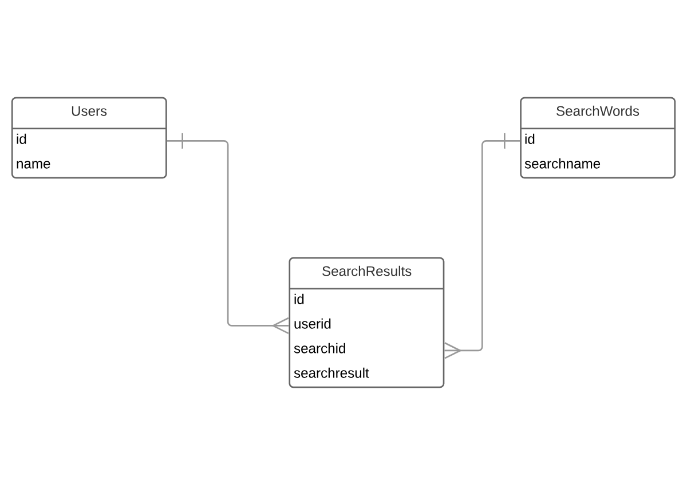

# Project Title

## Sens.ai - Brand Analysis Platform

## Presenting a flip side of the social media web platforms

- Facebook
- Twitter
- Reddit

## Project Planning


## Project Description

### Project Description - What problem your app solves
### Target auidence - Your app will be useful to whom?
### Team Members


## User Stories

## Wireframes


## Stack Choices

### Front End
- react and react-dom

### Back End

- node.js

### Database

- postgress SQL

## Project Setup

### Git Repo Setup


### Project scaffold

- Clone this project from git Repo (Write following commands on vagrant)

```
git clone <git repo uri for this project> Sens.ai
```

### dependencies

- "bluebird": "^3.5.1",
- "body-parser": "^1.18.3",
- "change-case": "^3.0.2",
- "chart.js": "^2.7.2",
- "dom-scroll-into-view": "^1.2.1",
- "dotenv": "^6.0.0",
- "express": "^4.16.3",
- "knex": "^0.14.6",
- "moment": "^2.22.2",
- "node-fetch": "^2.1.2",
- "paralleldots": "^3.1.1",
- "pg": "^7.4.3",
- "react": "^16.4.0",
- "react-addons-transition-group": "^15.6.2",
- "react-anchor-link-smooth-scroll": "^1.0.10",
- "react-burger-menu": "^2.5.0",
- "react-chartjs-2": "^2.7.2",
- "react-dom": "^16.4.0",
- "react-fade": "^1.1.1",
- "react-fade-in": "^0.1.6",
- "react-flexbox-grid": "^2.1.2",
- "react-scripts": "1.1.4",
- "react-scroll-into-view": "^1.2.0",
- "react-scroll-to-component": "^1.0.2",
- "react-scrollable-anchor": "^0.6.1",
- "react-spinners": "^0.3.2",
- "twit": "^2.2.10",
- "watson-developer-cloud": "^3.4.5"


### Install dependencies

- Write following commands on vagrant prompt

```
cd Sens.ai
npm install --save
```


## Database Setup

### CREATING NEW DATABASE

- Install Postgress SQL driver and Knex migration tool (on vagrant prompt).

````````
npm install pg --save
npm install knex --save
````````

- Write a following command to create database (on vagrant prompt).
```
psql -U vagrant -d template1

CREATE ROLE sensai WITH LOGIN PASSWORD 'sensai';
CREATE DATABASE sensai OWNER sensai;
```
- To login to Postgress database with user sensai

```
psql -U sensai
```

- To quit and logout Postgress database

```
\q
```

### Database Migration

- Run following KNEX commands to run database migrations.

```
CREATE TABLES: Write following command on vagrant prompt

knex migrate:latest;
```

```
DROP ALL TABLES: Write following command on vagrant prompt

knex migrate:rollback;
```

- Files taking part in database migration using Knex

```
Path: Sens.ai/server/db/migrations

Knex Migration Files:

20180604202202_create_user_table.js
20180604202704_create_search_table.js
20180604203059_create_table_searchresults.js
```

### Database Seeding

- Run following KNEX command to seed the sensai database

```
knex seed:run
```

- Files taking part in database seeding using Knex

```
Path: Sens.ai/server/db/migrations

Knex Migration Files:

1_seed_users.js
2_seed_search_words.js
3_seed_search_results.js
```

### Entity Relationship Diagram (ERD)



## Project Workflow

## Project Communication

- What has been accomplished
- What will you be working on
- What hardles are you facing

## Project Workflow

1. What are the project milestones: you need to create a list of the project milestones and specify what are the deadlines.

2. Git workflow: establish rules about how you’re going to manage your Git workflow. You can discuss it with a mentor if needed.

3. How to distribute teamwork: before distributing work, you might want to consider working together until you build the core of your app. Afterward, you need to think about how you will distribute the work among your team members.

4. Coding styles: consider establishing some coding guidelines to ensure consistency between team members.


### Project Development

- Deadline: Week 9, Day 5

### Project Deployment

## Testing, bug fixing

# Deadline: Demo day minus 2

- Testing, testing, testing
- Fixing bugs
- Refactoring your code
- Cleaning up your code

### Project Presentation

# Deadline: Demoday minus 1
